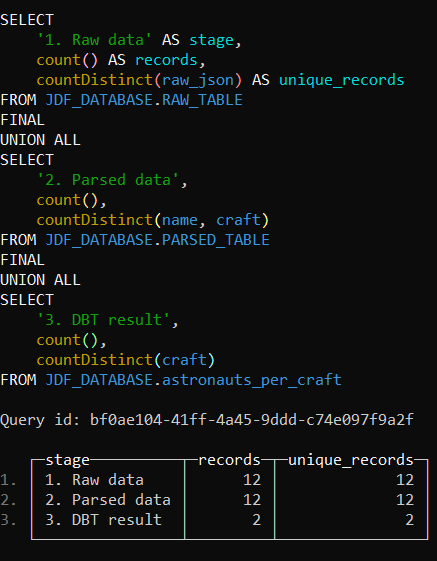

# Тестовое задание: Data Pipeline

1. **Запуск ClickHouse:**
cd docker
docker-compose up -d

2. **Установка зависимостей:**
pip install -r scripts/requirements.txt

3. **Загрузка данных:**
python scripts/load.py

4. **Настройка DBT:**
cp dbt/profiles.yml
Отредактируйте ~/.dbt/profiles.yml при необходимотси

5. **Запуск DBT:**
cd ./jdf_dbt_project
dbt run --select astronauts_per_craft

# Подключение к ClickHouse внутри контейнера
docker exec -it jdf-clickhouse clickhouse-client --user admin --password changeme

# запросы для выполнения 
-- Полная проверка пайплайна
SELECT 
    '1. Raw data' as stage,
    count() as records,
    countDistinct(raw_json) as unique_records
FROM JDF_DATABASE.RAW_TABLE
FINAL

UNION ALL

SELECT 
    '2. Parsed data',
    count(),
    countDistinct(name, craft)
FROM JDF_DATABASE.PARSED_TABLE
FINAL

UNION ALL

SELECT 
    '3. DBT result',
    count(),
    countDistinct(craft)
FROM JDF_DATABASE.astronauts_per_craft;

